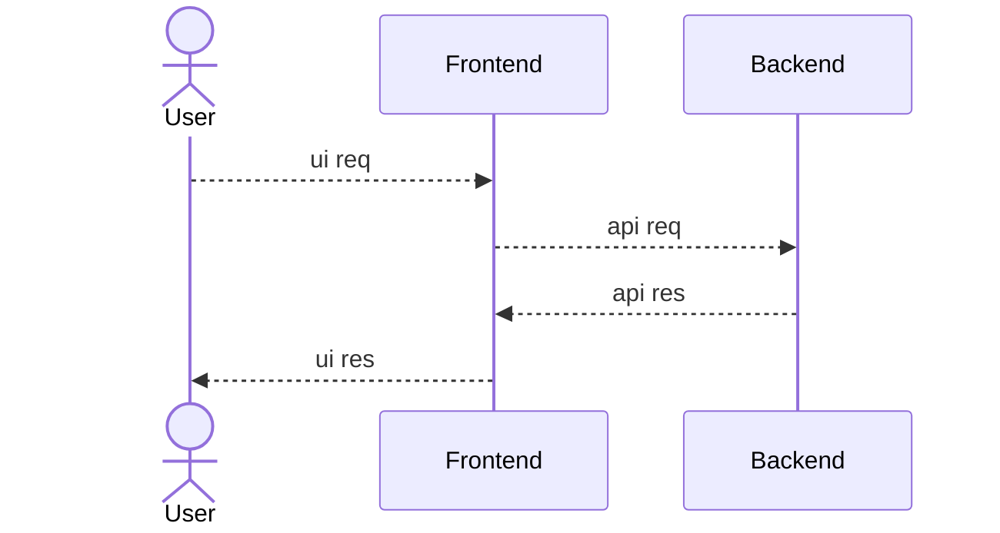
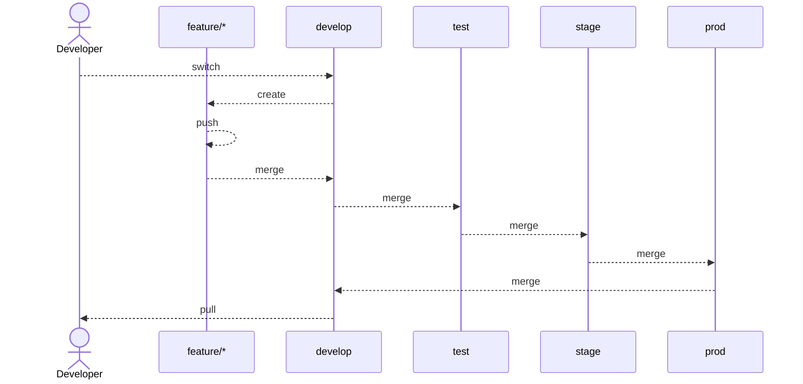
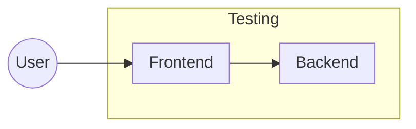

# POC #02 - Express Setup

## System Architecture

### 01. High Level Design (HLD)

```mermaid
  sequenceDiagram
    actor User
    participant Frontend
    participant Backend

    User -->> Frontend : ui req
    Frontend -->> Backend : api req
    Backend -->> Frontend : api res
    Frontend -->> User : ui res
```

### 02. Low Level Design (LLD)

#### 02.01. Git Branching & PR Strategies LLD

```mermaid
  sequenceDiagram
    actor Developer
    participant feature/*
    participant develop
    participant test
    participant stage
    participant prod

    Developer -->> develop : switch
    develop -->> feature/* : create
    feature/* -->> feature/* : push
    feature/* -->> develop : merge
    develop -->> test : merge
    test -->> stage : merge
    stage -->> prod : merge
    prod -->> develop : merge
    develop -->> Developer : pull
```

#### 02.02. Project Folder LLD

```mermaid
  flowchart LR
    User(("User"))
    subgraph Testing
      subgraph Frontend["Frontend"]
      end
      subgraph Backend["Backend"]
      end
    end

    User --> Frontend
    Frontend --> Backend
```