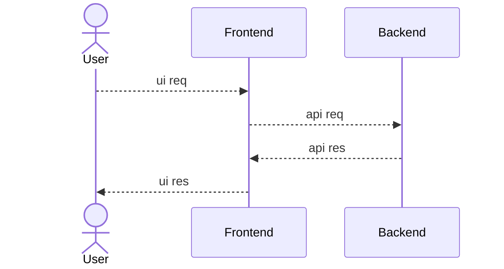

# POC #02 - Express Setup

## System Architecture

### 01. High Level Design (HLD)

```mermaid
  sequenceDiagram
    actor User
    participant Frontend
    participant Backend

    User -->> Frontend : ui req
    Frontend -->> Backend : api req
    Backend -->> Frontend : api res
    Frontend -->> User : ui res
```

### 02. Low Level Design (LLD)
