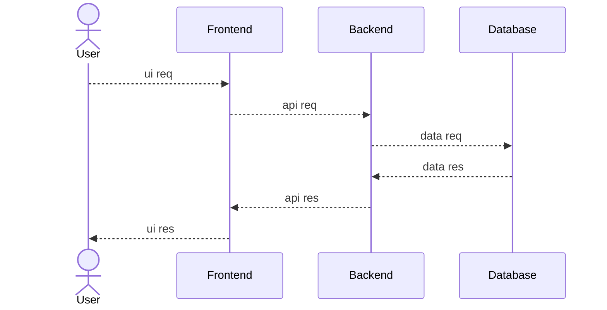
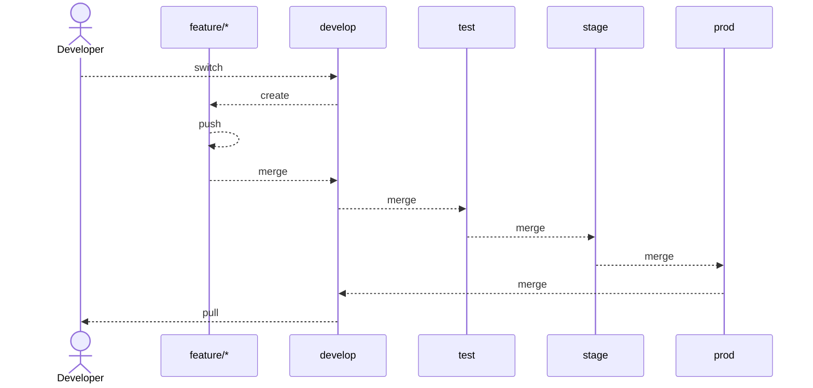
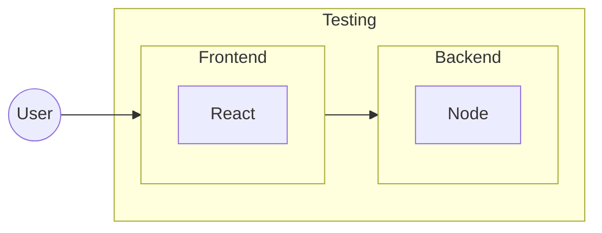
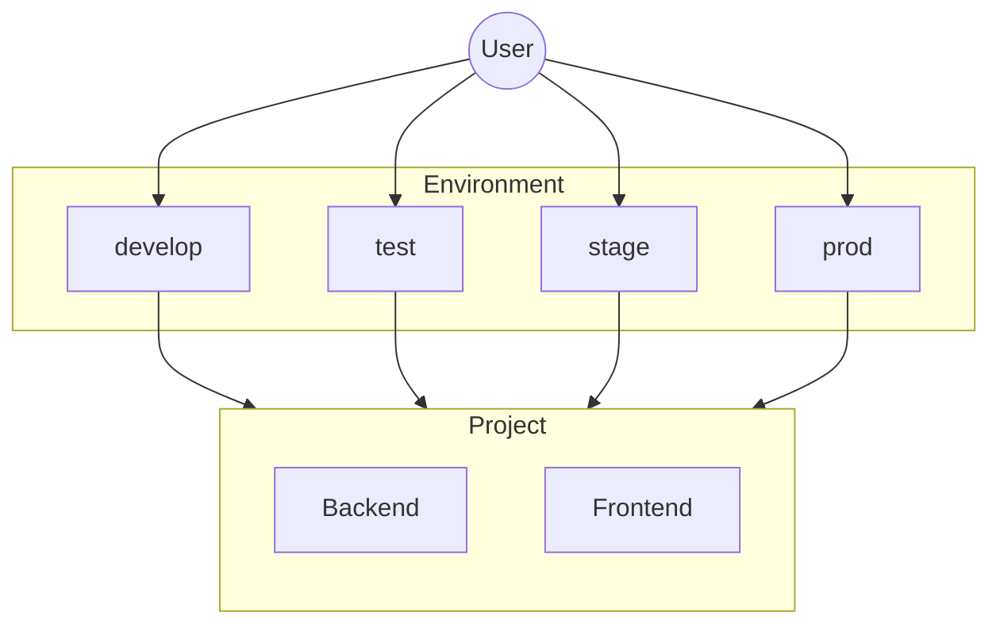

# POC #02 - Express & Shadcn Setup
Production Grade - Proof of Concept - Express & Shacn Setup

Visit Agile Management Baord
- Link: [https://github.com/users/OfficialApurvChatur/projects/8](https://github.com/users/OfficialApurvChatur/projects/8)

## System Architecture

### 01. High Level Design (HLD)

### 02. Low Level Design (LLD)

#### 02.01. Git Branching & PR Strategies Setup LLD

#### 02.02. Project Overview Setup LLD

#### 02.03. Environment Setup LLD

#### 02.04. Playwright Setup LLD

#### 02.05. Servers & DNS Setup LLD

#### 02.06. CI/CD Deployment Setup LLD

## Servers & DNS

### Backend
- Development
  - Local: [http://localhost:8001](http://localhost:8001)
  - Live: 

- Testing
  - Local: [http://localhost:8002](http://localhost:8002)
  - Live: 

- Staging
  - Local: [http://localhost:8003](http://localhost:8003)
  - Live: 

- Production
  - Local: [http://localhost:8004](http://localhost:8004)
  - Live: 

### Frontend
- Development
  - Local: [http://localhost:3001](http://localhost:3001)
  - Live: 

- Testing
  - Local: [http://localhost:3002](http://localhost:3002)
  - Live: 

- Staging
  - Local: [http://localhost:3003](http://localhost:3003)
  - Live: 

- Production
  - Local: [http://localhost:3004](http://localhost:3004)
  - Live: 
