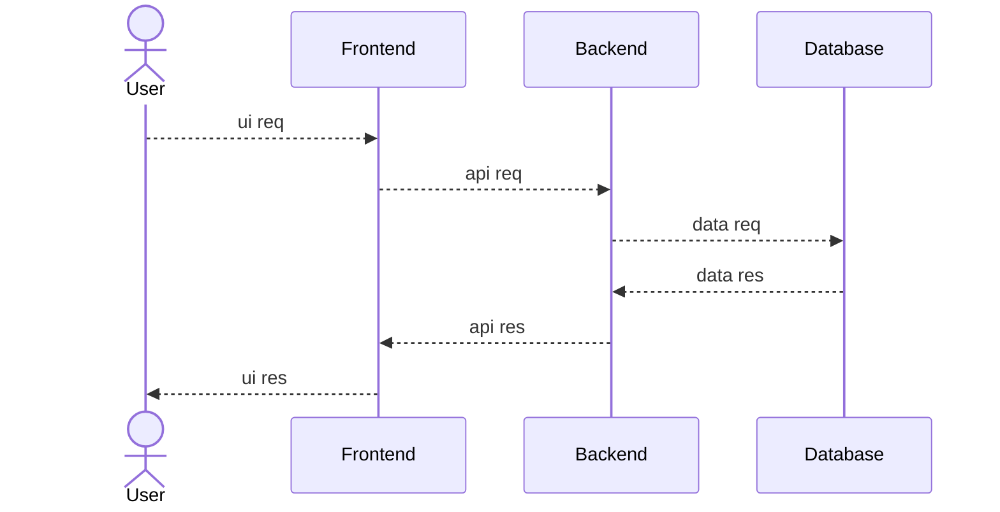

# POC #02 - Express & Shadcn Setup
Production Grade - Proof of Concept - Express & Shacn Setup

Visit Agile Management Baord
- Link: [https://github.com/users/OfficialApurvChatur/projects/8](https://github.com/users/OfficialApurvChatur/projects/8)

## System Architecture

### 01. High Level Design (HLD)


### 02. Low Level Design (LLD)

#### 02.01. Git Branching & PR Strategies Setup LLD
<!-- ```mermaid
  sequenceDiagram
    actor Developer
    participant feature/*
    participant develop
    participant test
    participant stage
    participant prod

    Developer -->> develop : switch
    develop -->> feature/* : create
    feature/* -->> feature/* : push
    feature/* -->> develop : merge
    develop -->> test : merge
    test -->> stage : merge
    stage -->> prod : merge
    prod -->> develop : merge
    develop -->> Developer : pull
``` -->

#### 02.02. Project Folder Setup LLD

#### 02.03. Environment Setup LLD

#### 02.04. Playwright Setup LLD

#### 02.05. Servers & DNS Setup LLD

#### 02.06. CI/CD Deployment Setup LLD

## Servers & DNS
